# Amazon EBS Volume Lost Recovery Automation using AWS Health

When an EBS volume is reported as lost by AWS Health as a result of underlying hardware failure, you can automatically recover the affected EC2 instance from a recent Amazon Machine Image (AMI) backup. This automated solution checks if the failed volume has a snapshot and is part of a root volume on an EC2 instance. The solution will then restore the instance root volume from the latest snapshot, upload the results to an Amazon Elasticsearch instance and send a notification to the SNS topic assigned. An Alexa Skill is also provided as an additional notification option.

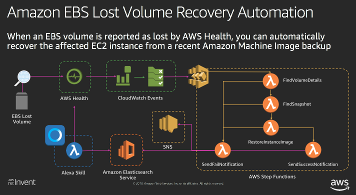

### Step 1 - Deploy Amazon Elasticsearch Stack and Kibana

In this step, we will deploy an Amazon Elasticsearch instance fronted by Kibana console. We will also provision an SNS topic that will be used for email communication regarding EBS lost volume events.

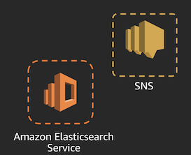

<details>
<summary>**[ Click here for detailed steps ]**</summary>
<p>

1. Navigate to the CloudFormation console by clicking on the **Services** drop-down, typing **CloudFormation** in the search bar, and pressing Enter.

    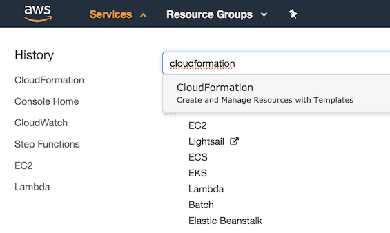

2. Click on **Create stack**.
3. Under **Specify template**, choose **Upload a template file**
5. Upload the file named *step\_1\_es\_ec2proxy\_reinvent\_workshop.yml*.
6. Click **Next**.
7. Enter a **Stack name**. Example: `ebs-es-reinvent`
8. Enter a public CIDR that Kibana will be accessible from. This is the public IP range that you will be accessing the dashboard from. If you aren't sure, you can find your public IP at https://www.myip.com/ and then append a /32 suffix to it. For example, if your public IP was 1.2.3.4, you would use: 1.2.3.4/32. For demo purposes, you can enter the CICR as `0.0.0.0/0`.
9. Click **Next**.
10. If desired, tag the resources by entering `Name` as the Key and `kibana_es_reinvent` as the Value.
11. Click **Next**.
12. Click the check box next to **I acknowledge that AWS CloudFormation might create IAM resources.**
13. Click **Create**.
14. Once you see CREATE_COMPLETE, select the Outputs tab and click on the link for **KibanaURL** to ensure Kibana is accessible and functioning.

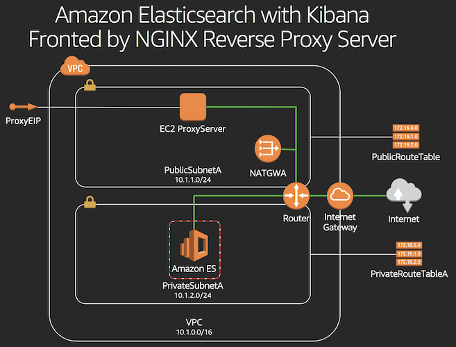

</p></details>

### [OPTIONAL] Prelude to Step 2: Build Step Function

This step is optional. If you choose to skip this step, it will have no impact on the automation solution we are building. This is a bonus step to understand how Step Functions state machines work.

<details>
<summary>**[ Click here for detailed steps ]**</summary><p>

Let us build a sample Step Function to evaluate whether the input number is even or odd. Based on the result, a Choice state will add branching logic.

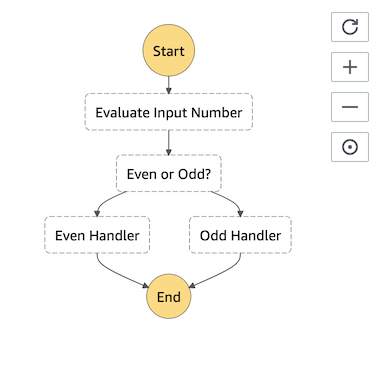

1. Navigate to the Lambda console by clicking on the **Services** drop-down, typing **Lambda** in the search bar, and pressing Enter.
2. Click on **Create function**.
3. Choose **Author from scratch**.
4. Enter **Name**. Example: `even_odd_evaluator`
5. In the **Runtime** drop-down, select **Node.js 8.10**.
6. In the **Role** drop-down, select **Choose an existing role**.
7. In the **Existing role** drop-down, select **lambda\_basic\_execution**.
8. Click on **Create function**.
9. Paste below code.

    ```
    exports.handler = async (event) => {
	    if (event.InputNumber % 2 === 0) {
	        return "even";
	    } else {
	        return "odd";
	    }
	};
    ```
1. Click on **Save**.
2. Repeat above steps to create a second function.
3. Name the function `even_function`, and paste below code.

    ```
    exports.handler = async (event) => {
	    const response = {
	        statusCode: 200,
	        body: JSON.stringify('The input number is even!'),
	    };
	    console.log(response);
	    return response;
	};
    ```
1. Click on **Save**.
2. Repeat above steps to create a third function.
3. Name the function `odd_function`, and paste below code.

    ```
    exports.handler = async (event) => {
	    const response = {
	        statusCode: 200,
	        body: JSON.stringify('The input number is odd!'),
	    };
	    console.log(response);
	    return response;
	};
    ```
1. Let's create the Step Function. Navigate to the Step Functions console by clicking on the **Services** drop-down, typing **Step Functions** in the search bar, and pressing Enter.
1. Click on **Create state machine**.
2. In the **Details** section, Enter **Name** of the state machine. Example: `even_odd_number_step_function`
3. In the **State machine definition** section, paste below code. Be sure to replace <mark>\<\<aws\_accoun\_id\>\></mark> with your AWS account ID. Check that the Lambda function names reflect the 3 functions you created.

    ```
    {
	  "Comment": "An example of the Amazon States Language that chooses a branch based on whether the input number is even or odd.",
	  "StartAt": "Evaluate Input Number",
	  "States": {
	    "Evaluate Input Number": {
	      "Type": "Task",
	      "Resource":
	      "arn:aws:lambda:us-east-1:<<aws_account_id>>:function:even_odd_evaluator",
	      "ResultPath": "$.result",
	      "Next": "Even or Odd?"
	    },
	    "Even or Odd?": {
	      "Type": "Choice",
	      "Choices": [
	        {
	          "Variable": "$.result",
	          "StringEquals": "even",
	          "Next": "Even Handler"
	        },
	        {
	          "Variable": "$.result",
	          "StringEquals": "odd",
	          "Next": "Odd Handler"
	        }
	      ]
	    },
	    "Even Handler": {
	      "Type": "Task",
	      "Resource":
	      "arn:aws:lambda:us-east-1:<<aws_account_id>>:function:even_function",
	      "End": true
	    }
	    ,
	    "Odd Handler": {
	      "Type": "Task",
	      "Resource":
	      "arn:aws:lambda:us-east-1:<<aws_account_id>>:function:odd_function",
	      "End": true
	    }
	  }
	}

    ```
1. Refresh button in the state machine graph area.
1. Click **Next**.
2. Choose **Create an IAM role for me**.
3. Enter Name of the role. Example: `StepFunctionsExecutionRoleForMyEvenOddEvalStateMachine`
4. Click **Create state machine**.
5. Click **Start execution**.
6. Provide below input and click on **Start execution**.

    ```
    {
	  "InputNumber": 120
	}
    ```

</p></details>

### Step 2 - Deploy Step Function and Lambda

In this step, we will create a Step Functions state machine comprised of Lambda functions to find out information about the EC2 instance impacted by the lost EBS volume, including Amazon Machine Image (AMI) details, CloudFormation Stack details, etc. Once these details are obtained, the state machine will kick off recovery steps by updating the CloudFormation stack with the new AMI, notify users through the SNS topic, and publish events to the Elasticsearch cluster.

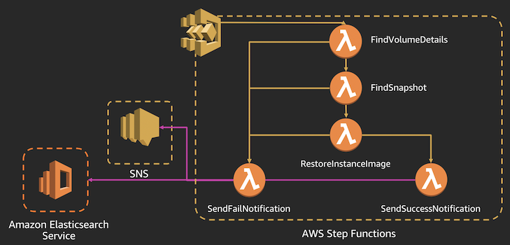

<details>
<summary>**[ Click here for detailed steps ]**</summary><p>

1. Navigate to the CloudFormation console by clicking on the **Services** drop-down, typing **CloudFormation** in the search bar, and pressing Enter.
2. Click on **Create stack**.
3. Under **Specify template**, choose **Upload a template file**
5. Upload the file named *step\_2\_stepfunctions\_reinvent\_workshop.yml*.
6. Click **Next**.
7. Enter a **Stack name**. Example: `stepfunction-reinvent`
8. Enter the Elasticsearch stack name chosen in Step 1 (sub-step 6) for ESStackName, an SNS topic name (e.g. `sns_es_reinvent`) and an email address for SNS notifications.
9. Click **Next**.
10. If desired, tag the resources by entering `Name` as the Key and `stepfunction_reinvent` as the Value.
11. Click **Next**.
12. Click the check box next to **I acknowledge that AWS CloudFormation might create IAM resources.**
13. Click **Create**.
14. Once the stack is created, you should receive an e-mail confirming the subscription to the SNS topic. Click **Confirm subscription**.

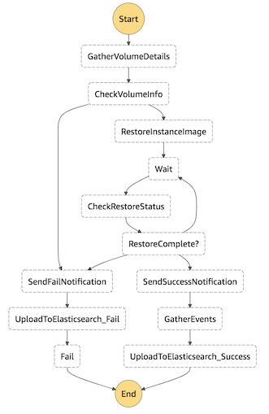

</p></details>

### Step 3 - Deploy App

In this step, we will deploy a demo app consisting of an EC2 instance with a root EBS volume, which we are going to simulate as lost.

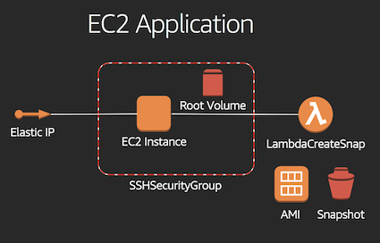

<details>
<summary>**[ Click here for detailed steps ]**</summary><p>

1. Navigate to the CloudFormation console by clicking on the **Services** drop-down, typing **CloudFormation** in the search bar, and pressing Enter.
2. Click on **Create stack**.
3. Under **Specify template**, choose **Upload a template file**
5. Upload the file named *step\_3\_app\_reinvent\_workshop.yml*.
6. Click **Next**.
7. Enter a Stack name, for example: `ebs-app-reinvent`
9. Select one of the two public subnets created in step 1 for the SubnetId parameter. If you aren't sure, navigate to the VPC Management Console, choose Subnets in the left menu and select one of the newly created subnets with the tag "PublicSubnetA" or "PublicSubnetB".
10. Select the VPC created in Step 1 for the VpcId parameter.
11. Click **Next**.
10. If desired, tag the resources by entering `Name` as the Key and `ebs_app_reinvent` as the Value.
11. Click **Next**.
12. Click the check box next to **I acknowledge that AWS CloudFormation might create IAM resources.**
13. Click **Create**.

</p></details>


### Step 4 - Create CloudWatch Events Rule and Target to Invoke Step Function

In this step, we will create a CloudWatch Events rule to capture EBS lost volume events and trigger the Step Functions state machine created in Step 2.

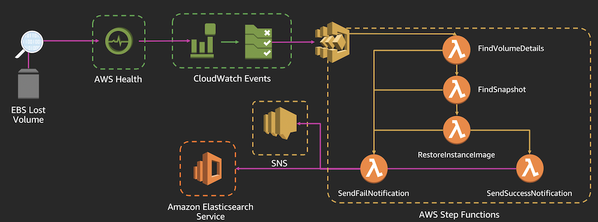

<details>
<summary>**[ Click here for detailed steps ]**</summary><p>

1. Navigate to the CloudWatch Events console by clicking on the **Services** drop-down, typing **CloudWatch** in the search bar, and pressing Enter.
2. In the **Navigation** pane, select **Rules**.
3. Click on **Create rule**.
4. Paste below event rule pattern.

    ```
    {
	  "source": [
	    "aws.health"
	  ],
	  "detail-type": [
	    "AWS Health Event"
	  ],
	  "detail": {
	    "service": [
	      "EBS"
	    ],
	    "eventTypeCategory": [
	      "issue"
	    ],
	    "eventTypeCode": [
	      "AWS_EBS_VOLUME_LOST"
	    ]
	  }
	}
    ```
1. Click on **Add target***.
2. Choose **Step Functions state machine**.
3. Select the state machine that you created in Step 2.
4. Choose **Create a new role for this specific resource**.
5. Click on **Configure details**.
6. Enter **Name**. Example: `ebs_events_rule_reinvent`
7. Click on **Create rule**.
8. Create another CloudWatch Events rule named `ebs_mock_events_rule_reinvent `. Paste below event rule pattern.

    ```
    {
	  "source": [
	    "awshealth.mock"
	  ],
	  "detail-type": [
	    "AWS Health Event"
	  ],
	  "detail": {
	    "service": [
	      "EBS"
	    ],
	    "eventTypeCategory": [
	      "issue"
	    ],
	    "eventTypeCode": [
	      "AWS_EBS_VOLUME_LOST"
	    ]
	  }
	}
    ```

</p></details>

### Step 5 - Test the Solution
<details>
<summary>**[ Click here for detailed steps ]**</summary><p>

1. Navigate to the EC2 console by clicking on the **Services** drop-down, typing **EC2** in the search bar, and pressing Enter.
2. Select the instance created in Step 4, and click on **/dev/xvda** next to Root Device and copy the EBS Volume ID.

**Consider below options to test:**

<details>
<summary>**Option 1:** Test by triggering mock CloudWatch event through **AWS CLI**</summary><p>

**Prerequisite:** You need to have the **AWS CLI** installed. Installation instructions can be found [here](https://docs.aws.amazon.com/cli/latest/userguide/installing.html).

3. Create a file named mockpayload.json with below contents. Be sure to replace <mark>\<\<ebs-vol-id\>\></mark> with the volume ID you copied. Also modify the **Time** of the event to be within the the past week so that Kibana and the Alexa skill return results.

    ```
	[
	  {
	    "DetailType": "AWS Health Event",
	    "Source": "awshealth.mock",
	    "Time": "2018-11-27T01:30:00Z",
	    "Resources": [
	      "<<ebs-vol-id>>"
	    ],
	    "Detail": "{\"eventArn\":\"arn:aws:health:us-east-1::event/event-1486428952619\",\"service\":\"EBS\",\"eventTypeCode\":\"AWS_EBS_VOLUME_LOST\",\"eventTypeCategory\":\"issue\",\"startTime\":\"Tue, 27 Nov 2018 01:30:00 GMT\",\"eventDescription\":[{\"language\":\"en_US\",\"latestDescription\":\"Your volume experienced a failure due to multiple component failures and we were unable to recover it. Although EBS volumes are designed for reliability, including being backed by multiple physical drives, we are still exposed to durability risks when multiple concurrent component failures occur before we are able to restore redundancy. We publish our durability expectations on the EBS detail page here (http://aws.amazon.com/ebs/details).\\n\\nFind out what you can do to fix this issue at https://aws.amazon.com/premiumsupport/knowledge-center/ebs-error-status/\\n\\nWe apologize for the inconvenience this may have caused you. If you have any further questions or comments regarding this matter, please contact us at: http://aws.amazon.com/support\"}],\"affectedEntities\":[{\"entityValue\":\"<<ebs-vol-id>>\"}]}"
	  }
	]
    ```
6. Run the following command, where region is the region you launched the stack in:
    `aws events put-events --entries file://mockpayload.json --region <region>`

</p></details>

<details>
<summary>**Option 2:** Test using Step Functions **Start execution** feature</summary><p>

1. Navigate to the Step Functions console by clicking on the **Services** drop-down, typing **Step Functions** in the search bar, and pressing Enter.
3. Click on the state machine named **StepFunctionVolumeLost-*** created as part of Step 2.
4. Click on **Start execution**.
4. Paste below payload that CloudWatch Events would pass if EBS volume lost event were to occur. Be sure to replace <mark>\<\<ebs-vol-id\>\></mark> with the volume ID you copied. Also modify the **time** of the event to be within the the past week so that Kibana and the Alexa skill return results.

    ```
    {
	    "detail-type": "AWS Health Event",
	    "id": "7bf73129-1428-4cd3-a780-98sdf9fdfs8f7",
	    "source": "awshealth.mock",
	    "time": "2018-11-27T01:30:00Z",
	    "resources": [
	        "<<ebs-vol-id>>"
	    ],
	    "detail": {
	        "eventArn": "arn:aws:health:us-east-1::event/event-1486428952619",
	        "service": "EBS",
	        "eventTypeCode": "AWS_EBS_VOLUME_LOST",
	        "eventTypeCategory": "issue",
	        "startTime": "Tue, 27 Nov 2018 01:30:00 GMT",
	        "eventDescription": [
	            {
	                "language": "en_US",
	                "latestDescription": "Your volume experienced a failure due to multiple component failures and we were unable to recover it. Although EBS volumes are designed for reliability, including being backed by multiple physical drives, we are still exposed to durability risks when multiple concurrent component failures occur before we are able to restore redundancy. We publish our durability expectations on the EBS detail page here (http://aws.amazon.com/ebs/details).\\n\\nFind out what you can do to fix this issue at https://aws.amazon.com/premiumsupport/knowledge-center/ebs-error-status/\\n\\nWe apologize for the inconvenience this may have caused you. If you have any further questions or comments regarding this matter, please contact us at: http://aws.amazon.com/support"
	            }
	        ],
	        "affectedEntities": [
	            {
	                "entityValue": "<<ebs-vol-id>>"
	            }
	        ]
	    }
	}
    ```
1. Click on **Start execution**.


</p></details>

</p></details>

### Step 6 - Setup Kibana
<details>
<summary>**[ Click here for detailed steps ]**</summary><p>
    
7. Navigate to the Kibana dashboard from Step 1.
8. Click **Management**.
9. Click **Index Patterns**.
10. Enter * as the index pattern.
11. Click **Next step**.
12. Select Timestamp from the Time filter drop down.
13. Click **Create Index pattern**.
14. Click **Saved Objects**.
15. Click **Import**.
16. Select the **kibana.json** file provided.
17. Click **Confirm all changes**
18. Click Dashboard
19. Click **PHD Events**
20. At the top right, choose a time frame that will include sub-set 6 above (for example, Last 4 hours)

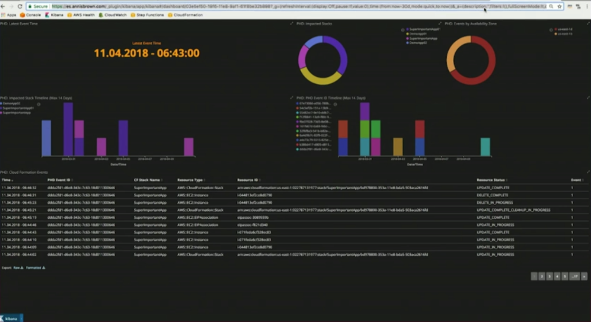

</p></details>


### Step 7 [BONUS] - Install Alexa Skill

In this step, we will create an Alexa skill that will invoke a Lambda function to query the latest events from the Elasticsearch cluster. The Lambda function will then form a sentence as a response for Alexa to read out to the user.

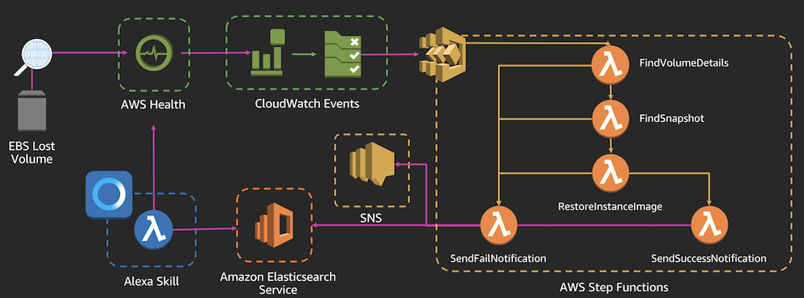

<details>
<summary>**[ Click here for detailed steps ]**</summary><p>

1. From the AWS Management Console, navigate to the **N. Virginia** (us-east-1) region.
1. Navigate to the Lambda console by clicking on the **Services** drop-down, typing **Lambda** in the search bar, and pressing Enter.
2. Click **Create Function**
3. Enter **Name**. Example: `alexa_ebs_reinvent`
4. Select **Python 3.6** for the Runtime.
1. In the **Role** drop-down, select **Create a custom role**.
1. In the **IAM role** drop-down, select **Create a new IAM role**.
1. In the **Role name** text box, type *alexa\_lambda\_admin\_role\_reinvent*.
2. Click on **View Policy Document**.
3. Click on **Edit**.
1. Paste below policy.

    ```
    {
	    "Version": "2012-10-17",
	    "Statement": [
	        {
	            "Effect": "Allow",
	            "Action": "*",
	            "Resource": "*"
	        }
	    ]
	}
    ```

1. Click on **Allow**.
2. Click on **Create function**.
8. Paste below code into the function.

    ```
    import json
	import datetime
	import urllib.request
	import dateutil.parser
	import math
	import os 
	
	WELCOME_MESSAGE = ("Welcome to Production Environment!  You can ask me about your production environment status!")
	EXIT_SKILL_MESSAGE = "Thank you! Enjoy the rest of your summit!"
	HELP_MESSAGE = ("I know stuff about your production environment! Ask away!")
	STATE_START = "Start"
	STATE = STATE_START
	
	date_handler = lambda obj: obj.strftime('%Y-%m-%d %H:%M:%S')
	
	def getLatestPhdEvent():
	    es = "http://"+os.environ['ES']
	    index = 'phd-full-events'
	    query = {
	        "size": 1,
	        "sort": [
	            {
	                "PhdEventTime": {
	                    "order": "desc"
	                }
	            }
	        ]
	    }
	    
	    # Elasticsearch Request/Response
	    payload = json.dumps(query).encode('utf-8')         # Encode query for HTTP request
	    request = urllib.request.Request(es + '/' + index + '/_search', payload, {'Content-Type': 'application/json'}, method='GET')    # Build HTTP request
	    response = urllib.request.urlopen(request).read()   # Send Request
	    response = json.loads(response.decode('utf-8'))     # Decode response and convert to JSON
	    return response['hits']['hits'][0]['_source']       # Return query payload    
	
	# --------------- entry point -----------------
	
	def lambda_handler(event, context):
	    print(event)
	    
	    """ App entry point  """
	    if event['request']['type'] == "LaunchRequest":
	        return on_launch()
	    elif event['request']['type'] == "IntentRequest": 
	        return on_intent(event['request'], event['session'])
	    elif event['request']['type'] == "SessionEndedRequest":
	        return on_session_ended(event['request'])
	
	
	# --------------- response handlers -----------------
	
	def on_intent(request, session):
	    """ Called on receipt of an Intent  """
	
	    intent = request['intent']
	    intent_name = request['intent']['name']
	
	    #print("on_intent " +intent_name)
	    get_state(session)
	
	    if 'dialogState' in request:
	        #delegate to Alexa until dialog sequence is complete
	        if request['dialogState'] == "STARTED" or request['dialogState'] == "IN_PROGRESS":
	            print (request['dialogState'])
	            return dialog_response("", False)
	
	    if intent_name == "GetNewEventIntent":
	        return get_event()
	    elif intent_name == "AMAZON.HelpIntent":
	        return do_help()
	    elif intent_name == "AMAZON.StopIntent":
	        return do_stop()
	    elif intent_name == "AMAZON.CancelIntent":
	        return do_stop()
	    else:
	        print("invalid intent reply with help")
	        return do_help()
	
	
	def do_stop():
	    attributes = {"state":globals()['STATE']}
	    return response(attributes, response_plain_text(EXIT_SKILL_MESSAGE, True))
	
	def do_help():
	    global STATE
	    STATE = STATE_START
	    attributes = {"state":globals()['STATE']}
	    return response(attributes, response_plain_text(HELP_MESSAGE, True))
	
	def on_launch():
	    return get_welcome_message()
	
	def on_session_ended(request):
	    if request['reason']:
	        end_reason = request['reason']
	        print("on_session_ended reason: " + end_reason)
	        
	def get_state(session):
	    """ get and set the current state  """
	
	    global STATE
	
	    if 'attributes' in session:
	        if 'state' in session['attributes']:
	            STATE = session['attributes']['state']
	        else:
	            STATE = STATE_START
	    else:
	        STATE = HELP_MESSAGE
	
	
	# --------------- response string formatters -----------------
	def get_welcome_message():
	    attributes = {"state":globals()['STATE']}
	    return response(attributes, response_plain_text(WELCOME_MESSAGE, False))
	
	def getDateTimeFromISO8601String(s):
	    d = dateutil.parser.parse(s)
	    return d
	
	def get_event():
	    attributes = {"state":globals()['STATE']}
	
	    payload = getLatestPhdEvent()
	    print(payload)
	    
	    ## Get Time ##
	    x = payload['PhdEventTime']
	    timeiso = getDateTimeFromISO8601String(x)
	    
	    ## Convert to AU/Melbourne ##
	    y = dateutil.parser.parse(x)
	    meltimeiso = y + datetime.timedelta(hours=int(os.environ['timezonedelta']))
	    eventtimestr = json.dumps(meltimeiso, default = date_handler)
	   
	    eventtime = datetime.datetime.strptime(eventtimestr.replace("\"", ""), "%Y-%m-%d  %H:%M:%S")
	    systemname =  payload['ResourceStack']['StackName']
	    eventid =  payload['PhdEventId']
	    recoverytime = payload['RestoredResources']['RestoredVolumes'][0]['CreateTime']
	    #recoverystatus = payload['NOTIFMESSAGE']['Message']
	    
	    # Compose Event time
	    eventdate = str(eventtime.year) + "-" + str(eventtime.month) + "-" + str(eventtime.day)
	    eventtimestr = str(eventtime.hour) + ":" + str(eventtime.minute)
	    dtime = datetime.datetime.strptime(eventtimestr, "%H:%M")
	    eventtime = dtime.strftime("%I:%M %p")
	    
	    # Find Recovery Time
	    reventlist = payload['ResourceStack']['StackEvents']
	    for revent in reventlist:
	        if revent['ResourceType'] == "AWS::CloudFormation::Stack":
	            if revent['ResourceStatus'] == "UPDATE_COMPLETE":
	                rendtime = revent['Timestamp']
	    
	    endtime = getDateTimeFromISO8601String(rendtime)
	    diff = endtime - timeiso
	    diffseconds = diff.total_seconds()
	    diffhours = diffseconds // 3600
	    diffminutes = (diffseconds % 3600) // 60
	    diffseconds = diffseconds % 60
	    recoveryhours =  str(math.ceil(diffhours))
	    recoveryminutes =  str(math.ceil(diffminutes))
	    recoveryseconds =  str(math.ceil(diffseconds))
	
	    LATEST_EVENT = ( "On "+ eventdate + " at " + eventtime + "! System " + systemname + " was down! " + "System is now recovered ! " + " Total Recovery time is " + recoveryhours + " hours " + recoveryminutes + " minutes and " + recoveryseconds + " seconds " +  "! Please check kibana for recovery details!")
	    return response(attributes, response_plain_text(LATEST_EVENT, True))
	
	def response(attributes, speech_response):
	    """ create a simple json response """
	
	    return {
	        'version': '1.0',
	        'sessionAttributes': attributes,
	        'response': speech_response
	    }
	    
	def response_plain_text(output, endsession):
	    """ create a simple json plain text response  """
	
	    return {
	        'outputSpeech': {
	            'type': 'PlainText',
	            'text': output
	        },
	        'shouldEndSession': endsession
	    }

    ```
9. Under Environment variables, enter `timezonedelta` as the Key and `-8` as the value.
10. Under Environment variables, enter `ES` as the Key and the `<<ESDomain_endpoint>>` from step 1 as the value.
11. Set up **Network** configuration of the Lambda function as shown below.
    * In the **VPC** drop-down, select the VPC of the *kibana\_es\_reinvent* app.
    * In the **Subnets** drop-down, select PrivateSubnetA (*10.1.2.0/24*) and PrivateSubnetB (*10.1.4.0/24*).
    * In the **Security Groups** drop-down, select the same security group as the ProxyServer.
11. Click **Save** at the top right of the page.

**Configure Alexa intent "GetNewEventIntent".**

1. Navigate to [https://developer.amazon.com/alexa](https://developer.amazon.com/alexa)
13. Sign In with your Amazon ID.
14. Click on **Create Alexa Skills**.

    

15. Click on **Start a Skill**.
16. Click on **Create Skill**.
17. Enter **Skill name**. Example: `Production`
18. Select **Default language** as **English (US)**.
19. Under **Choose a model to add to your skill**, select **Custom**.
20. Click on **Create Skill**.
21. Select **Start from scratch**.
22. Click on **Choose**.
23. In the **Navigation** pane, click on **Intents**.
24. Click on **Add Intent**.
25. Choose **Create custom intent** and enter name of intent as `GetNewEventIntent`.
26. Click on **Create custom intent**.
27. Under **Sample Utterances**, enter `Latest Events`.
28. Click on **+**.
29. Click on **Save Model**.
32. In the **Navigation** pane, select **Endpoint**.
33. Choose **AWS Lambda ARN** option.
34. In the **Default Region** text box, enter the ARN of the Lambda function created in this step.
35. In the **North America** text box, enter the same ARN value.
36. Copy the **Your Skill ID** to clipboard.
37. Click on **Save Endpoints**.
29. In the **Navigation** pane, select **Interfaces**.
30. Enable the **Audio Player** option.
31. Click on **Save Interfaces**.
32. Click on **Build Model**.
33. Navigate back to the Lambda function in the AWS Management Console.
34. Under the **Add triggers** section, select **Alexa Skills Kit**.
35. In the **Skill ID** text box, cope the skill ID that was copied to the clipboard.
36. Click on **Add**.
37. Head back to the **Alexa Developer Console**.
38. Click on **Test** tab.
39. Type in `Alexa, ask production about latest events` or talk into your computer's microphone.


</p></details>
