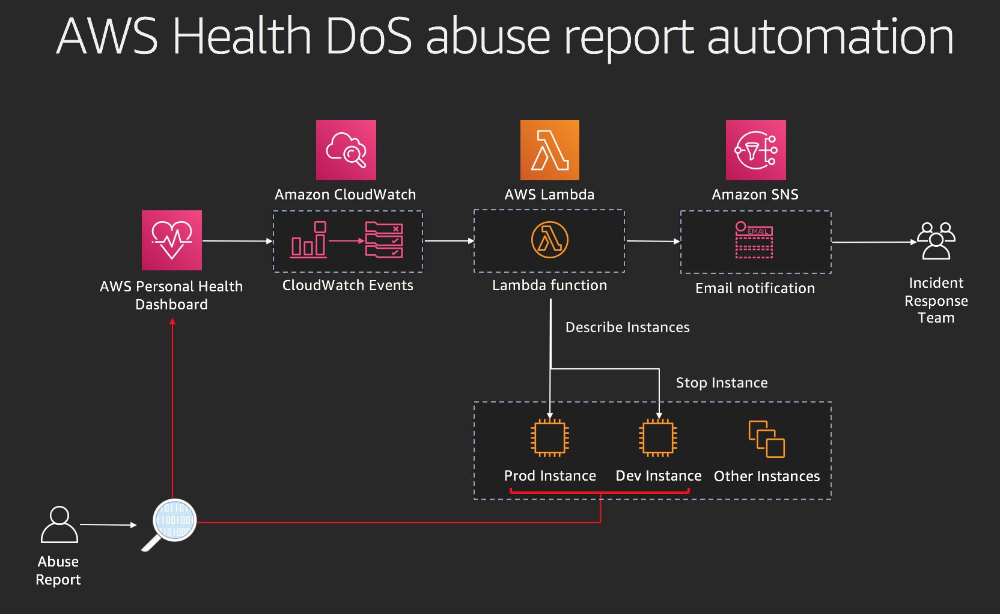
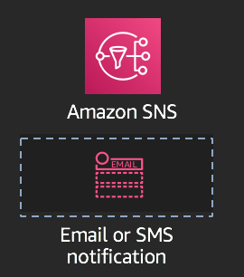
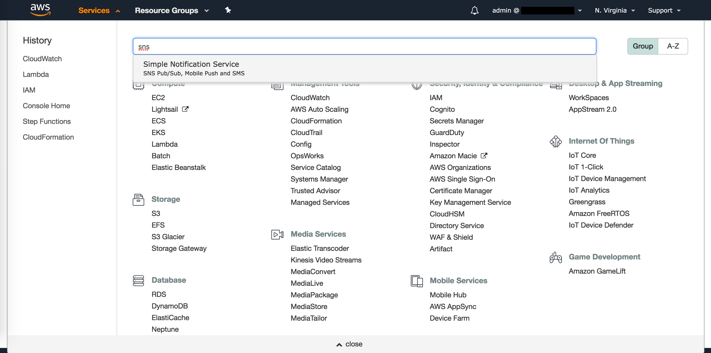
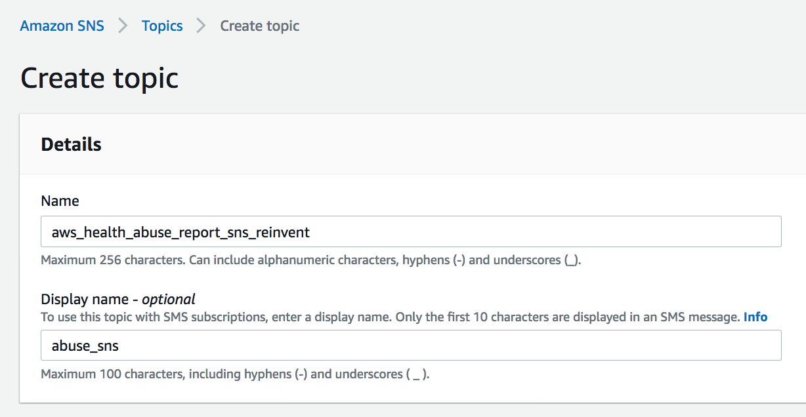
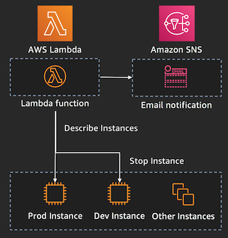
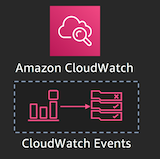

# Handling AWS Health Denial of Service (DoS) Abuse Events

AWS Abuse addresses many different types of potentially abusive activity such as phishing, malware, spam, and denial of service (DoS) / distributed denial of service (DDoS) incidents. When abuse is reported, we alert customers through AWS Health / Personal Health Dashboard so they can take the remediation action that is necessary. Customers want to build automation for handling abuse events and the actions to remediate them.

These steps will go through the how to set up the workflow described above ti handle DoS incidents.



### Step 1 - Setup AWS Abuse Event Subscription in Amazon SNS

In this step, we will be creating an SNS topic that will be used to send out emails related to AWS Abuse reports.



<details>
<summary>**[ Click here for detailed steps ]**</summary>
<p>
	
1. From the AWS Management Console, navigate to the **N. Virginia** (us-east-1) region.
1. Navigate to the SNS console by clicking on the **Services** drop-down, typing **SNS** in the search bar, and pressing Enter.
    
    
    
1. Select **Create topic**.
1. Enter a **Topic name**. Example: `aws_health_abuse_report_sns_reinvent`
1. Enter a **Display name**. Example: *abuse\_sns*
1. Click on **Create topic**.

    

1. Click on **Creation subscription**.
1. Click on the **Protocol** drop-down and select **SMS**. You can select other protocols, such as HTTPS, and setup webhooks to forward Abuse notifications to systems used within your organization such as Slack, Jira, PagerDuty, etc.
1. Enter a mobile number where you would like to receive SMSes about AWS Health Abuse events. Example: *1-206-555-0100*

    <!--Note that SMS will be sent only for **US-based mobile numbers**. If you do not have one, please create an SNS subscription to your email ID.-->
    
1. Click on **Create subscription**.

</p>
</details>

### Step 2 - Provision Sample EC2 Instances

In this step, we will be creating test EC2 instances that will be used to simulate automated actions.


<details>
<summary>**[ Click here for detailed steps ]**</summary>
<p>
	
1. From the AWS Management Console, navigate to the **N. Virginia** (us-east-1) region.
1. Navigate to the EC2 console by clicking on the **Services** drop-down, typing **EC2** in the search bar, and pressing Enter.
1. Create 2 new EC2 instances with any configuration.
2. Set below tags:
 * Instance 1: Key=`Stage`; Value=`Dev`, signifying a non-Production EC2 instance.
 * Instance 2: Key=`Stage`; Value=`Prod`, signifying a Production EC2 instance.

</p>
</details>

### Step 3 - Create AWS Lambda Function to Parse DoS Abuse Events

In this step, we will be creating a Lambda function to parse the AWS abuse event, publish a notification to the SNS topic created in Step 1, and stop/terminate the non-production EC2 instances that are reported as part of the Abuse event.



<details>
<summary>**[ Click here for detailed steps ]**</summary>
<p>

1. Navigate to the AWS Lambda console by clicking on the **Services** drop-down, typing **Lambda** in the search bar, and pressing Enter.
1. In the **Navigation** pane, click on **Functions**.
1. Click on **Create function**.
1. Let the selection remain on **Author from scratch**.
1. Enter a **Name** for the Lambda function. Example: *aws\_health\_dos\_abuse\_report\_handler\_lambda\_reinvent*
1. In the **Runtime** drop-down, select **Node.js 8.10**.
1. In the **Role** drop-down, select **Create a custom role**.

    
    
1. In the **IAM role** drop-down, select **Create a new IAM role**.
1. In the **Role name** text box, type *aws\_health\_dos\_lambda\_role\_reinvent*
2. Click on **View Policy Document**.
3. Click on **Edit**.
1. Paste below policy. Be sure to replace <mark>\<\<aws\_accoun\_id\>\></mark> with your AWS account ID and <mark>\<\<SNS\_topic\_name\>\></mark> with the topic name you created as part of Step 1.

    ```
	{
		"Version": "2012-10-17",
	    "Statement": [
	        {
	            "Action": [
	                "logs:CreateLogGroup",
	                "logs:CreateLogStream",
	                "logs:PutLogEvents"
	            ],
	            "Resource": "arn:aws:logs:*:*:*",
	            "Effect": "Allow",
	            "Sid": "AllowLambdaPermissionsToLogInCloudWatchLogs"
	        },
	        {
	            "Action": [
	                "sns:Publish"
	            ],
	            "Resource": "arn:aws:sns:us-east-1:<<aws_account_id>>:<<SNS_topic_name>>",
	            "Effect": "Allow",
	            "Sid": "AllowLambdaPermissionsToPublishSNS"
	        },
	        {
	            "Action": [
	                "ec2:DescribeInstances",
					   "ec2:TerminateInstances",
					   "ec2:StopInstances"
	            ],
	            "Resource": "*",
	            "Effect": "Allow",
	            "Sid": "AllowLambdaPermissionsToDescribeStopTerminateEC2"
	        }
	    ]
	}
   ```
1. Click on **Allow**.
2. Click on **Create function**.
3. Paste below code into the Lambda function.

    ```
	// Sample Lambda Function to stop/terminate non-Prod EC2 instances that are
	// reported as part of a Denial of Service AWS Health event. Also send
	// notifications to an SNS topic.
	var AWS = require('aws-sdk');
	var _ = require('lodash');
	var sns = new AWS.SNS();
	
	// define configuration
	const snsTopic = process.env.SNSARN;
	const tagKey = process.env.EC2_STAGE_TAG_KEY;
	const tagValue = process.env.EC2_PROD_STAGE_TAG_VALUE;
	const action = process.env.EC2_ACTION;
	const dryRun = process.env.DRY_RUN;
	
	function setupClient(region) {
	    // set the region for the sdk
	    AWS.config.update({ region: region });
	    //create the ec2 client
	    return new AWS.EC2();
	}
	
	function getParams(instances, dryRun) {
	    // setup parameters
	    var instancesParams = {
	        InstanceIds: instances,
	        DryRun: false
	    };
	    // enable DryRun if set in environment variables
	    if (dryRun == 'true') {
	        instancesParams.DryRun = true;
	        console.log()
	    }
	    return instancesParams
	}
	
	// Main function which gets AWS Health data from CloudWatch event
	exports.handler = (event, context, callback) => {
	
	    // function to handle ec2 API response
	    function handleResponse(err, data) {
	        if (err) {
	            // an error occurred
	            if (err.code == 'DryRunOperation') {
	                console.log(instances, region, err.message);
	                callback(null, awsHealthSuccessMessage);
	            }
	            else {
	                console.log(instances, region, err, err.stack);
	                throw err;
	            }
	
	        }
	        else {
	            // successful response
	            console.log(`Instance ${action}: `, instances, region);
	
	            snsPublishParams = {
	                Message: `Instance ${action} invoked on Non-Prod EC2 instance(s) part of DoS event.`,
	                Subject: eventName,
	                TopicArn: snsTopic
	            };
	            sns.publish(snsPublishParams, function(err, data) {
	                if (err) {
	                    const snsPublishErrorMessage = `Error publishing confirmation of automation action taken on the EC2 instance(s) to SNS`;
	                    console.log(snsPublishErrorMessage, err);
	                }
	                else {
	                    const snsPublishSuccessMessage = `Successfully actioned the EC2 instance(s) and published to SNS topic.`;
	                    console.log(snsPublishSuccessMessage, data);
	                }
	            });
	
	            //return success
	            callback(null, awsHealthSuccessMessage);
	        }
	    }
	
	    //extract details from CloudWatch event
	    var healthMessage = event.detail.eventDescription[0].latestDescription + ' Non-Prod EC2 instances part of DoS report will be attempted to be stopped/terminated. For more details, please see https://phd.aws.amazon.com/phd/home?region=us-east-1#/dashboard/open-issues';
	    var eventName = event.detail.eventTypeCode;
	    var affectedEntities = event.detail.affectedEntities;
	    var region = 'us-east-1'; // Setting to us-east-1 for demo. Region will have to be determined based on the region of each instance.
	
	    const awsHealthSuccessMessage = `Successfully parsed details from AWS Health event ${eventName}, and executed automated action.`;
	
	    //prepare message for SNS to publish
	    var snsPublishParams = {
	        Message: healthMessage,
	        Subject: eventName,
	        TopicArn: snsTopic
	    };
	    sns.publish(snsPublishParams, function(err, data) {
	        if (err) {
	            const snsPublishErrorMessage = `Error publishing AWS Health event to SNS`;
	            console.log(snsPublishErrorMessage, err);
	        }
	        else {
	            const snsPublishSuccessMessage = `Successfully actioned EC2 instances, and published to SNS topic.`;
	            console.log(snsPublishSuccessMessage, data);
	        }
	    });
	
	    // Get a list of all the EC2 instances reported as part of the event.
	    var instances = [];
	    for (var i = 0; i < affectedEntities.length; i++) {
	        if (affectedEntities[i].entityValue.split(":")[2] === "ec2") {
	            // Check if the entity is an EC2 instance.
	            var instanceArn = affectedEntities[i].entityValue;
	            // Extract the ID from ARN.
	            instances.push(instanceArn.split("/")[instanceArn.split("/").length - 1]);
	        }
	    }
	
	    if (instances.length > 0) {
	        //there are some instances to take action on
	
	        //create an ec2 api client in the event's region
	        var ec2 = setupClient(region);
	
	        // setup parameters
	        var instancesParams = getParams(instances, dryRun);
	
	        // DecsribeInstances that are associated with this event.
	        ec2.describeInstances(instancesParams, function(err, data) {
	            if (err) {
	                console.log("Error", err.stack);
	            }
	            else {
	                //console.log("Success", JSON.stringify(data));
	                var allInstancesDescribed = _.map(data.Reservations, function(reservation) { return reservation.Instances; });
	                allInstancesDescribed = _.flatten(allInstancesDescribed);
	                //console.log("allInstancesDescribed", JSON.stringify(allInstancesDescribed));
	
	                // Filter the list of instances described to select only those 
	                // instances that have Stage!=Prod key:value pair.
	                var nonProdInstances = _.filter(allInstancesDescribed, function(instance) {
	                    var tags = _.map(instance.Tags, function(tag) { return tag; });
	                    for (var j = 0; j < tags.length; j++) {
	                        if ((tags[j].Key == tagKey) && (tags[j].Value == tagValue)) {
	                            //console.log("Prod instance found", instance.InstanceId);
	                            // Exclude prod instances before taking automated action.
	                            return false;
	                        }
	                    }
	                    console.log("Non-Prod instance found", instance.InstanceId);
	                    return true;
	                });
	
	                instances = _.map(nonProdInstances, function(instance) {
	                    return instance.InstanceId;
	                });
	
	                //console.log("Non-Prod instance IDs", instances);
	
	                instancesParams = getParams(instances, dryRun);
	                console.log(`attempting to ${action} the following instances: `, instances);
	                // Call either the Terminate or the Stop API
	                if (action == 'Terminate') ec2.terminateInstances(instancesParams, handleResponse);
	                else ec2.stopInstances(instancesParams, handleResponse);
	            }
	        });
	    }
	    else {
	        console.log('No instances in the event match the required tags, exiting without any action');
	        callback(null, awsHealthSuccessMessage);
	    }
	};
    ```

1. Create following **Environment variable**:
 * Key=`SNSARN`; Value=`<<ARN_of_SNS_Topic>>`
 * Key=`DRY_RUN`; Value=`false`
 * Key=`EC2_ACTION`; Value=`Stop`
 * Key=`EC2_STAGE_TAG_KEY`; Value=`Stage`
 * Key=`EC2_PROD_STAGE_TAG_VALUE`; Value=`Prod`

3. Under **Basic settings**, set **timeout** to `25` sec.
4. Click on **Save** to save changes to the Lambda function.

</p>
</details>

### Step 4 - Setup Amazon CloudWatch Events Rule and Target

In this step, we will be creating a CloudWatch Events rule to capture AWS Abuse events and linking the Lambda function created in Step 3 as the target.



<details>
<summary>**[ Click here for detailed steps ]**</summary>
<p>

1. Navigate to the Amazon CloudWatch console by clicking on the **Services** drop-down, typing **CloudWatch** in the search bar, and pressing Enter.
2. In the **Navigation** pane, select **Rules**.
3. Click on **Create rule**.
4. Under **Event Patter Preview**, click on **Edit**.
5. Paste below rule.

    ```
	{
	  "source": [
	    "aws.health"
	  ],
	  "detail-type": [
	    "AWS Health Abuse Event"
	  ],
	  "detail": {
	    "service": [
	      "ABUSE"
	    ],
	    "eventTypeCategory": [
	      "issue"
	    ],
	    "eventTypeCode": [
	      "AWS_ABUSE_DOS_REPORT"
	    ]
	  }
	}
    ```
1. Click on **Save**.
2. Under **Targets**, click on **Add target\***.
3. Select the Lambda function created in Step 2.
4. Click on **Configure details**.
5. 	Enter **Name**. Example: *aws\_health\_dos\_report\_cwe\_rule\_reinvent*
6. Click on **Create rule**.
1. Create another CloudWatch Events rule that will capture capture a mock Health event. Name it *mock\_aws\_health\_dos\_report\_cwe\_rule\_reinvent*

    ```
    {
	  "source": [
	    "awsmock.health"
	  ],
	  "detail-type": [
	    "AWS Health Abuse Event"
	  ],
	  "detail": {
	    "service": [
	      "ABUSE"
	    ],
	    "eventTypeCategory": [
	      "issue"
	    ],
	    "eventTypeCode": [
	      "AWS_ABUSE_DOS_REPORT"
	    ]
	  }
	}
    ```
</p></details>

### Step 5 - Test the Solution
<details>
<summary>**[ Click here for detailed steps ]**</summary><p>

**Consider below options to test:**

<details>
<summary>**Option 1:** Test by triggering mock CloudWatch event through **AWS CLI**</summary><p>

**Prerequisite:** You need to have the **AWS CLI** installed. Installation instructions can be found [here](https://docs.aws.amazon.com/cli/latest/userguide/installing.html).

1. Create a file named *mockpayload.json* with below contents. Be sure to replace <mark>\<\<aws\_accoun\_id\>\></mark> with your AWS account ID and <mark>\<\<Instance\_ID\>\></mark> with the ID of the instances you created as part of Step 2.

    ```
    [
	    {
	        "DetailType": "AWS Health Abuse Event",
	        "Source": "awsmock.health",
	        "Time": "2018-11-26T10:00:00Z",
	        "Resources": [
	            "arn:aws:ec2:us-east-1:<<aws_account_id>>:instance/<<Instance_ID_1>>",
	            "arn:aws:ec2:us-east-1:<<aws_account_id>>:instance/<<Instance_ID_2>>"
	        ],
	        "Detail": "{\"eventArn\": \"arn:aws:health:global::event/AWS_ABUSE_DOS_REPORT_3223324344_3243_234_34_34\",\"service\": \"ABUSE\",\"eventTypeCode\": \"AWS_ABUSE_DOS_REPORT\",\"eventTypeCategory\": \"issue\",\"startTime\": \"Mon, 26 Nov 2018 10:00:00 GMT\",\"eventDescription\": [{\"language\": \"en_US\",\"latestDescription\": \"Denial of Service (DOS) attack has been reported to have been caused by AWS resources in your account.\"}],\"affectedEntities\": [{\"entityValue\": \"arn:aws:ec2:us-east-1:<<aws_account_id>>:instance/<<Instance_ID_1>>\"},{\"entityValue\": \"arn:aws:ec2:us-east-1:<<aws_account_id>>:instance/<<Instance_ID_2>>\"}]}"
		}
	]
    ```
1. Run the following command in your terminal.
    
    `aws events put-events --entries file://mockpayload.json --region us-east-1`
    
</p></details>

<details>
<summary>**Option 2:** Test using Lambda Test feature</summary><p>

1. Navigate to the Lambda console by clicking on the **Services** drop-down, typing **Lambda** in the search bar, and pressing Enter.
2. Click on the Lambda function created in Step 3.
3. Click on **Select a test event** drop-down next to the Test button.
4. Select **Create new test event**.
5. Enter **Event name**. Example: *testebs*
6. Paste below input. Be sure to replace <mark>\<\<aws\_accoun\_id\>\></mark> with your AWS account ID and <mark>\<\<Instance\_ID\>\></mark> with the ID of the instances you created as part of Step 2.

    ```
    {
	    "detail-type": "AWS Health Abuse Event",
	    "source": "awsmock.health",
	    "time": "2018-11-26T10:00:00Z",
	    "resources": [
	        "arn:aws:ec2:us-east-1:<<aws_account_id>>:instance/<<Instance_ID_1>>",
	        "arn:aws:ec2:us-east-1:<<aws_account_id>>:instance/<<Instance_ID_2>>"
	    ],
	    "detail": {
	        "eventArn": "arn:aws:health:global::event/AWS_ABUSE_DOS_REPORT_3223324344_3243_234_34_34",
	        "service": "ABUSE",
	        "eventTypeCode": "AWS_ABUSE_DOS_REPORT",
	        "eventTypeCategory": "issue",
	        "startTime": "Mon, 26 Nov 2018 10:00:00 GMT",
	        "eventDescription": [
	            {
	                "language": "en_US",
	                "latestDescription": "Denial of Service (DOS) attack has been reported to have been caused by AWS resources in your account."
	            }
	        ],
	        "affectedEntities": [
	            {
	                "entityValue": "arn:aws:ec2:us-east-1:<<aws_account_id>>:instance/<<Instance_ID_1>>"
	            },
	            {
	                "entityValue": "arn:aws:ec2:us-east-1:<<aws_account_id>>:instance/<<Instance_ID_2>>"
	            }
	        ]
	    }
	}
    ```

1. Click on **Create**.
2. Ensure that *testebs* test event is selected in the drop-down. Click on **Test**.

</p></details>

</p>
</details>

### Pro Tip: Utilize IAM Policy Conditions for Fine-Grained Access Control
<details>
<summary>**[ Click here for details ]**</summary>
<p>

AWS Health supports notifying customers about sensitive events such as those related to Abuse, exposed credentials, compromised accounts, etc. If you have a need to control access to such events, use the IAM fine-grained access control available with AWS Health API / Personal Health Dashboard and CloudWatch Events.

Sample CloudWatch Events policy to deny access to create rules that capture Abuse events:

```
{
    "Version": "2012-10-17",
    "Statement": [
        {
            "Sid": "AllowPutRuleIfSourceIsHealthAndDetailTypeIsAbuseEvent",
            "Effect": "Deny",
            "Action": "events:PutRule",
            "Resource": "*",
            "Condition": {
                "StringEquals": {
                    "events:source": "aws.health",
                    "events:detail-type": "AWS Health Abuse Event"
                }
            }
        }
    ]
}
```

Sample AWS Health policy to allow access to view all events except Abuse events on Health API / Personal Health Dashboard:

```
{
    "Version": "2012-10-17",
    "Statement": [
        {
            "Effect": "Allow",
            "Action": "health:Describe*",
            "Resource": "*"
        },
        {
            "Effect": "Deny",
            "Action": [
                "health:DescribeAffectedEntities",
                "health:DescribeEventDetails"
            ],
            "Resource": "*",
            "Condition": {
                "StringEquals": {
                    "health:service": "ABUSE"
                }
            }
        }
    ]
}
```

</p>
</details>